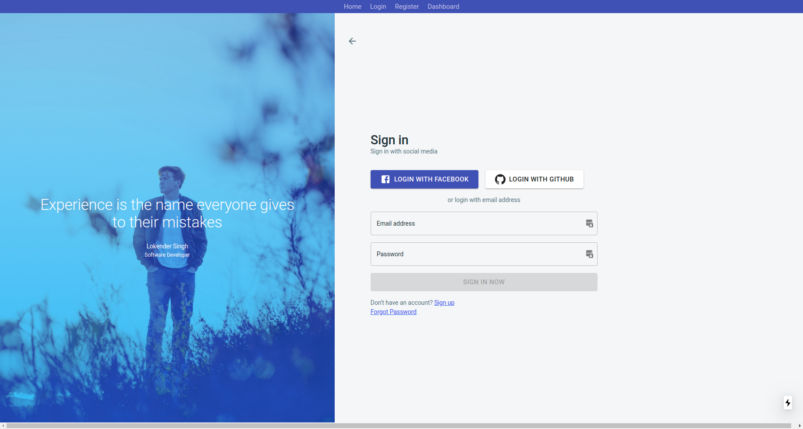
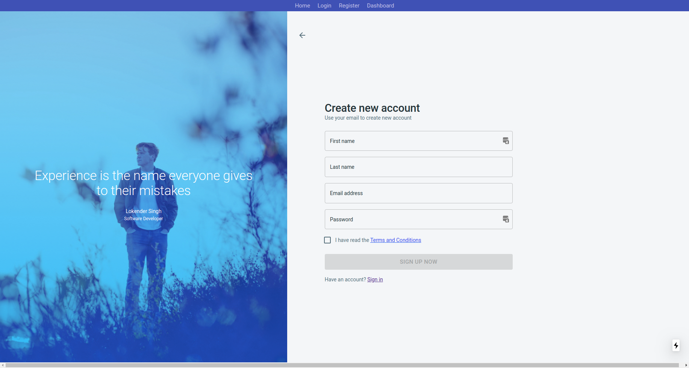
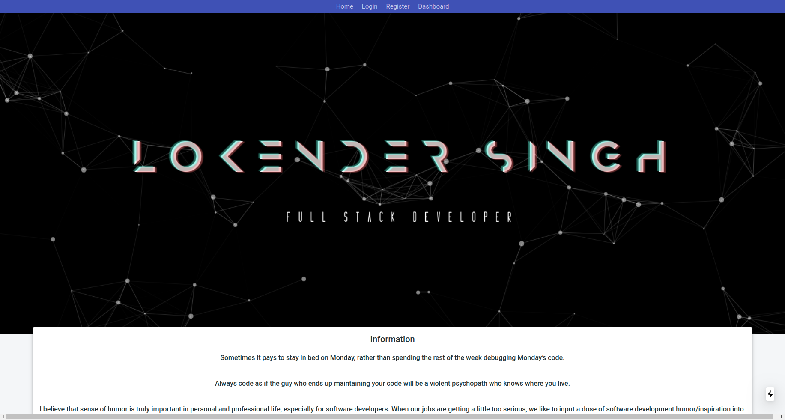
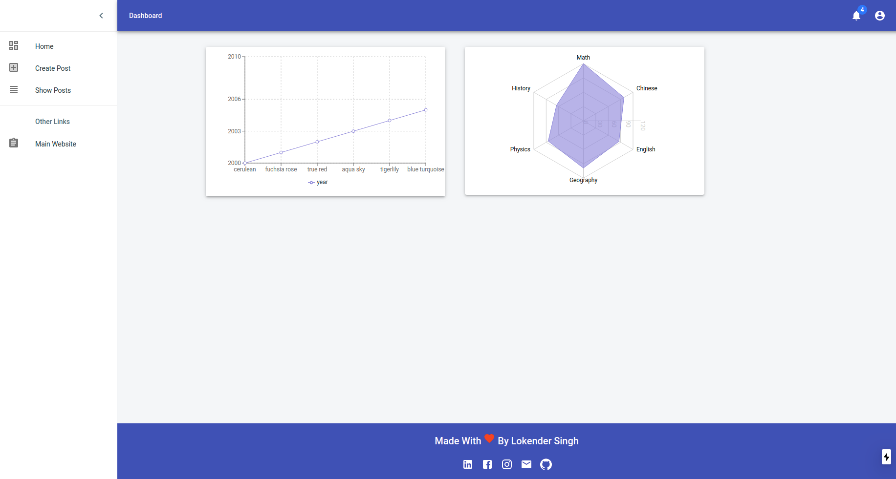
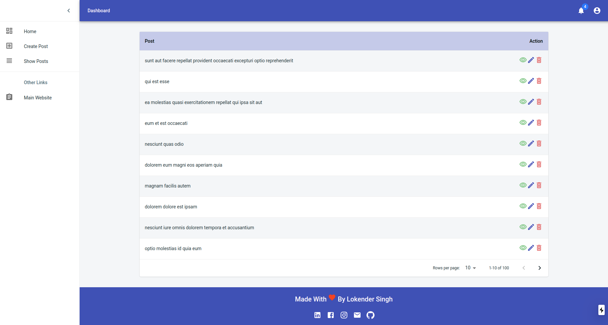

# React_NextJS_MaterialUI_Admin_DashBoard
```
It's a simple SSR (server side rendering) admin dashboard 
thats made by using following frontend technologies
- ReactJS
- NextJS
- MaterialUI

```
## How To Run 
```
    1. Install Packages
    yarn

    2. start Client App
    yarn dev

```

## Tasks Completed
1. Homepage
2. Login Page
3. SignUp Page
4. Dashboard
5. create Post
6. Update Post
7. Delete Post
8. Show Post
9. Show Posts List
10. Add remote curd api
11. Add Graphs


## Demo ScreenShots
- Login


- SignUp


- HomePage


- DashBoard


- Posts List


